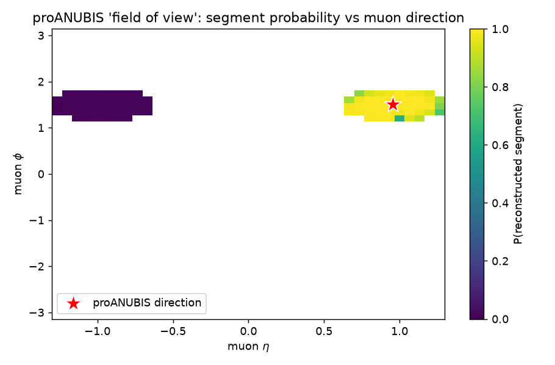
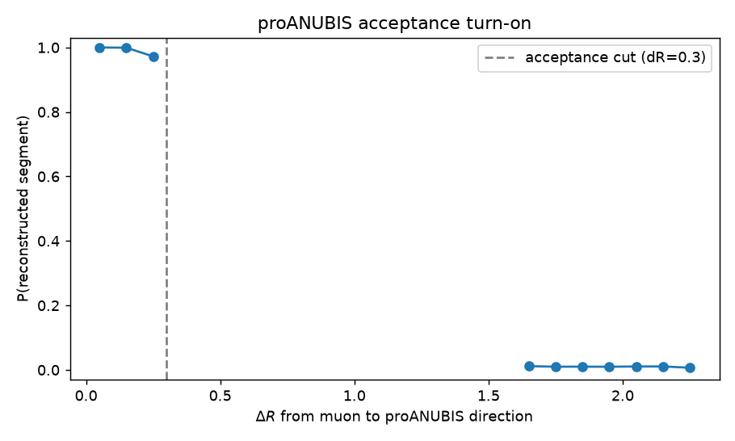

# anubis-ml

[](https://github.com/raahimnawaz/anubis-ml/actions/workflows/tests.yml)
[](https://www.python.org/)
[](https://root.cern/)
[](LICENSE)

Machine learning on **real ATLAS proANUBIS calibration data** (13.6 TeV LHC proton–proton
collisions), read straight from CERN's ROOT `TTree` files with `RDataFrame`.

Two supervised tasks, chosen so each teaches something about doing ML on real detector data
rather than just reporting a number:

| # | Task | Headline | The lesson |
|---|------|----------|------------|
| **1** | Is a muon from a **Z boson**? | AUC 0.70 (kinematics only) | A feature can be defeated by how the data was *skimmed* — the invariant-mass trick is impossible here because the Z's partner muon was removed upstream. |
| **2** | Does a muon leave a **proANUBIS segment**? | ~98% detector efficiency | A headline AUC of 0.99 can just be re-deriving your *event selection*; the real physics is the efficiency and its falloff at the detector edge. |

Both tasks share one theme that transfers directly to robotics perception/estimation:
**understand how your data was produced and selected before you trust a model on it.**

## Task 2 in one picture

proANUBIS is a prototype detector sitting at a fixed direction in ATLAS. A muon either points
at it (and leaves a reconstructed track *segment*) or it doesn't. Learning that from the muon's
direction reconstructs the detector's **field of view** — the same shape as a sensor-coverage
map in robotics. The bright blob is the detector; the dark blob is the **η-flipped control
sample** (muons aimed at the empty opposite side, so no segment); everything else is empty
because the data is skimmed to just those two regions:




## Data

[ATLAS proANUBIS Calibration Data Set](https://opendata.cern.ch/record/atlas-93943) — real
(not simulated) 13.6 TeV pp data, 2024–2025. 49.1M events / 423 ROOT files / 6.0 GiB,
DOI [`10.7483/OPENDATA.ATLAS.2J92.7ASX`](https://doi.org/10.7483/OPENDATA.ATLAS.2J92.7ASX).

Each file holds a ROOT `TTree` named `analysis`, one row per collision, with variable-length
arrays per event:

- **muons** — `muon_pt/eta/phi/charge`, plus truth flags `muon_isFromZ`, `muon_isFromJPsi`
- **jets** — `jet_pt/eta/phi/M/EMRatio`
- **muon segments** — `mseg_x/y/z` + direction cosines (the proANUBIS trajectory hits)
- **event-level** — trigger bits (`diMuTrigger`, `singleMuTrigger`, …), pileup, timing

Units are ATLAS default: **MeV, mm, ns**. This repo runs against a 9-file local subset
(~240 MB) placed in `data/`; only `.gitkeep` is committed — download your own from the portal.

## Quickstart (Docker — recommended)

ROOT is notoriously painful to install, so the repo ships a container built on CERN's
official ROOT image. This is the reproducible path — identical environment on any machine:

```bash
docker compose build
# smoke-test the whole ROOT pipeline on a synthetic sample (no real data needed):
docker compose run --rm anubis bash -c \
  "python3 tests/make_sample_root.py && python3 src/features_segments.py data/sample.ANALYSIS.root && python3 src/train_segments.py"
# ...or run against real data you dropped in ./data (bind-mounted into the container):
docker compose run --rm anubis python3 src/features_segments.py
docker compose run --rm anubis pytest tests/
```

The exact same in-container pipeline runs in CI (see the `pipeline` job in
[.github/workflows/tests.yml](.github/workflows/tests.yml)).

## Setup (conda / WSL — alternative)

If you'd rather not use Docker: ROOT's Python bindings ship only for **Linux/macOS** — there is
no conda or pip build for native Windows. On Windows, run everything inside **WSL2**:

```bash
# in WSL (Ubuntu) — one time:
curl -fsSL -o ~/miniforge.sh https://github.com/conda-forge/miniforge/releases/latest/download/Miniforge3-Linux-x86_64.sh
bash ~/miniforge.sh -b -p ~/miniforge3
~/miniforge3/bin/conda env create -f /mnt/c/Users/Raahim/Downloads/anubis-ml/environment.yml
~/miniforge3/envs/anubis-ml/bin/python -c "import ROOT; print(ROOT.__version__)"   # sanity check
```

On Linux/macOS natively: `conda env create -f environment.yml && conda activate anubis-ml`.

## Pipeline

Run from the repo root (in WSL, prefix with the env's python, e.g.
`~/miniforge3/envs/anubis-ml/bin/python`):

```bash
python src/explore.py data/<file>.root    # inspect: branches, types, summary stats

# Task 1 — Z-muon tagging
python src/features.py                     # data/*.root -> data/muons.parquet
python src/train.py                        # full vs kinematics-only models
python src/diagnose.py                     # (optional) ablations that exposed the skim

# Task 2 — proANUBIS segment detection
python src/features_segments.py            # data/*.root -> data/segments.parquet
python src/train_segments.py               # acceptance vs efficiency models
python src/make_figures.py                 # regenerate docs/figures/*.png

pytest tests/                              # geometry unit tests (no ROOT / data needed)
```

## Project layout

```
src/
  explore.py            inspect any .root file's TTree
  geometry.py           pure-NumPy proANUBIS geometry (Delta-R); no ROOT dependency
  features.py           Task 1: per-muon feature table  -> muons.parquet
  train.py              Task 1: full vs kinematics-only classifier
  diagnose.py           Task 1: univariate-AUC / ablation study
  features_segments.py  Task 2: per-muon segment table  -> segments.parquet
  train_segments.py     Task 2: acceptance vs efficiency classifier
  make_figures.py       Task 2: acceptance map + turn-on curve
tests/
  test_geometry.py      geometry unit tests (run in CI, no ROOT)
  make_sample_root.py   synthetic .root fixture generator for the in-container smoke test
docs/figures/           generated plots embedded above
Dockerfile              ROOT + ML env, built on rootproject/root
docker-compose.yml      convenience wrapper (bind-mounts ./data)
environment.yml         conda spec (the non-Docker path)
```

See [WRITEUP.md](WRITEUP.md) for the full narrative of both tasks — including the failed
hypothesis in Task 1, which is the most useful part.
